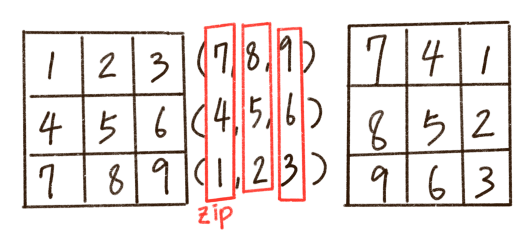

# Q10 : 자물쇠와 열쇠 by KKS
> 문제 주소: https://programmers.co.kr/learn/courses/30/lessons/60059
> 
> category: implementation/simulation

## 1.문제설명
- 자물쇠 영역 내에서는 열쇠의 돌기 부분과 자물쇠의 홈 부분이 정확히 일치해야 하며  
- 열쇠의 돌기와 자물쇠의 돌기가 만나서는 안됩니다.   
- 또한 자물쇠의 모든 홈을 채워 비어있는 곳이 없어야 자물쇠를 열 수 있습니다.  
- 열쇠를 나타내는 2차원 배열 key와 자물쇠를 나타내는 2차원 배열 lock이 매개변수로 주어질 때,   
- 열쇠로 자물쇠를 열수 있으면 true를, 열 수 없으면 false를 return 하도록 solution 함수를 완성해주세요.
## 2. 문제 접근법 
- padding의 개념이 필요하다
- padding을 통해 (2*m + n) by (2*m + b) 의 2차원 리스트를 만들어야한다.
```python
[[0, 0, 0, 0, 0, 0, 0, 0, 0], 
 [0, 0, 0, 0, 0, 0, 0, 0, 0], 
 [0, 0, 0, 0, 0, 0, 0, 0, 0], 
 [0, 0, 0, 1, 1, 1, 0, 0, 0], 
 [0, 0, 0, 1, 1, 0, 0, 0, 0], 
 [0, 0, 0, 1, 0, 1, 0, 0, 0], 
 [0, 0, 0, 0, 0, 0, 0, 0, 0], 
 [0, 0, 0, 0, 0, 0, 0, 0, 0], 
 [0, 0, 0, 0, 0, 0, 0, 0, 0]]
```
m = 3, n = 3 일때의 예시
## 3.문제 해결 아이디어 or 핵심
### 구현해야할 기능들
- 열쇠 넣어보기
```python
def attach(x, y, M, key, board):
    for i in range(M):
        for j in range(M):
            board[x+i][y+j] += key[i][j]
```
- 열쇠 제거
```python
def detach(x, y, M, key, board):
    for i in range(M):
        for j in range(M):
            board[x+i][y+j] -= key[i][j]
```
- 맞는지 체크
```python
def check(board, M, N):
    for i in range(N):
        for j in range(N):
            if board[M+i][M+j] != 1:
                return False;
    return True
```
- 로테이션(회전)
```python
def rotate90(arr):
    return list(zip(*arr[::-1]))
```

## 4.특별히 참고할 사항
- 회전을 구현하는 함수는 2차원 리스트를 이용한 문제에 다시한번 쓸수도 있을것 같다.
- 자물쇠의 범위를 벗어나도 되는 문제를 padding으로 해결할수 있다.

```python
#zip 이란?
arr = [[1,2,3], [4,5,6], [7,8,9]]
print(list(zip(*arr)))
print(list(zip(*arr[::-1])))
```
- 결과
```
[(1, 4, 7), (2, 5, 8), (3, 6, 9)]
[(7, 4, 1), (8, 5, 2), (9, 6, 3)]
```
## 5.코드구현
``` python
def attach(x, y, M, key, board)
    for i in range(M):
        for j in range(M):
            board[x + i][y + j] += key[i][j]


def detach(x, y, M, key, board):
    for i in range(M):
        for j in range(M):
            board[x + i][y + j] -= key[i][j]


def check(board, M, N):
    for i in range(N):
        for j in range(N):
            if board[M + i][M + j] != 1:
                return False
    return True


def rotate90(arr):
    return list(zip(*arr[::-1]))
# M:열쇠, N:자물쇠
def solution(key, lock):
    M, N = len(key), len(lock)  # 문제의 논리에 따라 진행하다
    #패딩
    board = [[0] * (M * 2 + N) for _ in range(M * 2 + N)]
    # 자물쇠를 중앙에 배치
    for i in range(N):
        for j in range(N):
            board[M + i][M + j] = lock[i][j]

    rotated_key = key
    # 모든 방향 (4번 루프)
    for _ in range(4):
        rotated_key = rotate90(rotated_key)
        for x in range(1, M + N):
            for y in range(1, M + N):
                # 열쇠 넣어보기
                attach(x, y, M, rotated_key, board)
                if (check(board, M, N)):
                    return True
                detach(x, y, M, rotated_key, board)
    return False
```