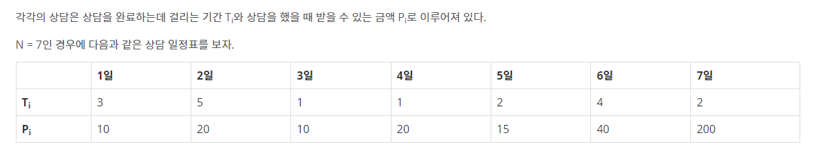

# Q33 : 퇴사 by KKS
> 문제 주소: book (https://www.acmicpc.net/problem/14501)
> 
> category: DP

## 1.문제설명
- 슬슬 퇴사하려고한다
- N + 1일후에 퇴사하는데 그전에 최대한 돈을 많이 땡기려함

- 이런 일정표가 있는데 이때 상담을 수행해서 최대한 돈을 땡겼을때 얼마나 벌수 있을까?
## 2. 문제 접근법 
- 상담 스케쥴을 2차원리스트로 저장해놓자. (시간순서대로 들어옴 어차피)
- 뒤의 날짜부터 dp테이블을 업데이트시켜간다

## 3.문제 해결 아이디어 or 핵심
- shedule이라는 리스트를 만들어서 그 안에 상담소요시간, 보수금액을 리스트로 집어넣는다
```python
schedule = [list(map(int, input().split())) for _ in range(N)]
# [[3, 10], [5, 20], [1, 10] ....... [2,200]]
dp = [0 for _ in range(N+1)]
```
- 로직은 다음과 같다
  - 마지막날부터 시작해서, 마지막날 있는 일정을 확인해본다 
  - 현재날짜 + 소요시간 > N이면 그날 일정을 수행하지 못하고 전날까지 번 금액으로 dp를 업데이트시킴
  - 만약에 현재날짜 + 소요시간 < N이면 그 일을 수행하는게 더 돈을버는지 안하는게 더 돈을버는지 확인해봄
  - 이런식으로 계속 업데이트
```python
for i in range(N-1, -1, -1):
    if schedule[i][0] + i <= N:
        #max(i일날 스케쥴로 벌수있는돈 + (i+스케쥴 소요시간)날까지 벌수있는 최대돈, i+1일날까지 벌수있는 최대돈)
        dp[i] = max(schedule[i][1] + dp[i + schedule[i][0]], dp[i+1])
    else:
        dp[i] = dp[i+1]
```
## 4.특별히 참고할 사항
- 끝에서부터 업데이트를 하는 생각을 했어야했다.

## 5.코드구현
``` python
N = int(input())
schedule = [list(map(int, input().split())) for _ in range(N)]
dp = [0 for _ in range(N+1)]
for i in range(N-1, -1, -1):
    if schedule[i][0] + i <= N:
        dp[i] = max(schedule[i][1] + dp[i + schedule[i][0]], dp[i+1])
    else:
        dp[i] = dp[i+1]
print(dp[0])
```