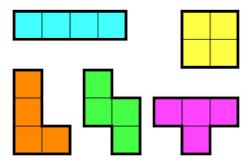
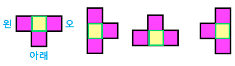

# boj 14500 : 테트로미노
> 문제 주소: https://www.acmicpc.net/problem/14500
> 
> 난이도: gold 5

## 1.문제설명
- 
- 이녀석들을 회전하고 대칭시켜서 판 위에 올렸을 때 정사각형이 놓인 부분들의 합의 최대값은?
## 2.문제해결 아이디어.
- ㅗ 모양을 제외하면 4번 이동하면 만들수 있다.
- ㅗ 와 나머지 도형들을 구분해서 최대값을 탐색한 후 비교하자
## 3.문제접근법
- 결국에 4번까지 dfs를 한 경우의 최대값과
```python
def dfs(i, j, dsum, cnt):
    global maxValue
    # 모양 완성되었을 때 최대값 계산
    if cnt == 4:
        maxValue = max(maxValue, dsum)
        return

    # 상, 하, 좌, 우로 이동
    for n in range(4):
        ni = i+move[n][0]
        nj = j+move[n][1]
        if 0 <= ni < N and 0 <= nj < M and not visited[ni][nj]:
            # 방문 표시 및 제거
            visited[ni][nj] = True
            dfs(ni, nj, dsum + board[ni][nj], cnt+1)
            visited[ni][nj] = False
```
- ㅗ 모양이 가질 수 있는 최대값을 비교해주면됨
- 
```python
def exce(i, j):
    global maxValue
    for n in range(4):
        # 초기값은 시작지점의 값으로 지정
        tmp = board[i][j]
        for k in range(3):
            # move 배열의 요소를 3개씩 사용할 수 있도록 인덱스 계산
            # 중앙을 기준으로 세 방향으로만 움직이면됨
            # 012, 123, 230, 301
            t = (n+k)%4 
            ni = i+move[t][0]
            nj = j+move[t][1]

            if not (0 <= ni < N and 0 <= nj < M):
                tmp = 0
                break
            tmp += board[ni][nj]
        # 최대값 계산
        maxValue = max(maxValue, tmp)
```

## 4.특별히 참고할 사항
- 벡트래킹에 대해서 공부해야함
- ㅗ를 제외한 나머지 케이스를 dfs를 4번 돌리면 만들 수 있다는 것을 모르면 못풀지 않을까?
## 5.코드구현
``` python
import sys
input = sys.stdin.readline

# R L D U
move = [(0, 1), (0, -1), (1, 0), (-1, 0)]

# INPUT
N, M = map(int, input().split())
board = [list(map(int,input().split())) for _ in range(N)]
visited = [[False] * M for _ in range(N)]

# 최대값 변수
maxValue = 0

# ㅗ, ㅜ, ㅓ, ㅏ 제외한 모양들 최대값 계산
def dfs(i, j, dsum, cnt):
    global maxValue
    # 모양 완성되었을 때 최대값 계산
    if cnt == 4:
        maxValue = max(maxValue, dsum)
        return

    # 상, 하, 좌, 우로 이동
    for n in range(4):
        ni = i+move[n][0]
        nj = j+move[n][1]
        if 0 <= ni < N and 0 <= nj < M and not visited[ni][nj]:
            # 방문 표시 및 제거
            visited[ni][nj] = True
            dfs(ni, nj, dsum + board[ni][nj], cnt+1)
            visited[ni][nj] = False


# ㅗ, ㅜ, ㅓ, ㅏ 모양의 최대값 계산
def exce(i, j):
    global maxValue
    for n in range(4):
        # 초기값은 시작지점의 값으로 지정
        tmp = board[i][j]
        for k in range(3):
            # move 배열의 요소를 3개씩 사용할 수 있도록 인덱스 계산
            # 012, 123, 230, 301
            # 중앙을 기준으로 세 방향으로만 움직이면됨
            t = (n+k)%4
            ni = i+move[t][0]
            nj = j+move[t][1]

            if not (0 <= ni < N and 0 <= nj < M):
                tmp = 0
                break
            tmp += board[ni][nj]
        # 최대값 계산
        maxValue = max(maxValue, tmp)


for i in range(N):
    for j in range(M):
        # 시작점 visited 표시
        visited[i][j] = True
        dfs(i, j, board[i][j], 1)
        visited[i][j] = False

        exce(i, j)

print(maxValue)
```