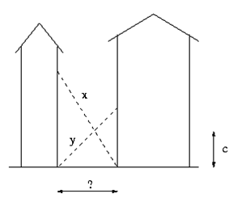
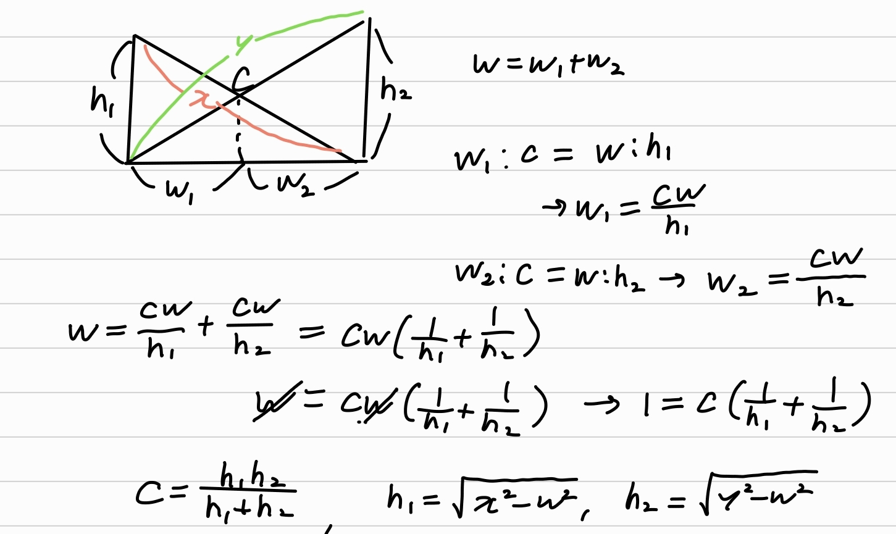

# boj 2022 : 사다리
> 문제 주소: https://www.acmicpc.net/problem/2022
> 
> 난이도: silver 1

## 1.문제설명

- 위 그림과 같이 빌딩 사이를 따라 좁은 길이 나있다.
- 두개의 사다리가 있고 길이가 x, y이다. 그리고 두 사다리는 땅에서부터 높이가 c인지점에서 정확하게 교차한다.
- 이때 두 빌딩사이의 거리는?
## 2.문제해결 아이디어.
- 빌딩사이의 거리가 멀어지면 c는 작아질꺼고
- 빌당사이의 거리가 짧아지면 c는 커질것 이다.
- 우리가 알고싶은건 w이니 c를 w에 대해 정리해보자
## 3.문제접근법

- c를 다음과 같이 구할수 있다.
- w를 변경하며 c를 찾아보자.
- 오차는 10^-3까지 허용한다고 하니 참고하자
## 4.특별히 참고할 사항
- 수학적인 센스? 라고 해야하나... 무튼 중요한듯하다.
## 5.코드구현
``` python
x, y, c = map(float, input().split())
high = min(x,y)
low = 1
ans = 0
while low+0.001 <= high:
    w = (low+high)/2
    #w를 이용해서 c계산해봄
    h1 = (x**2-w**2)**0.5
    h2 = (y**2-w**2)**0.5
    guess_c = (h1*h2)/(h1+h2)
    if guess_c >= c:
        ans = w
        low = w
    else:
        high = w
print(ans)
```