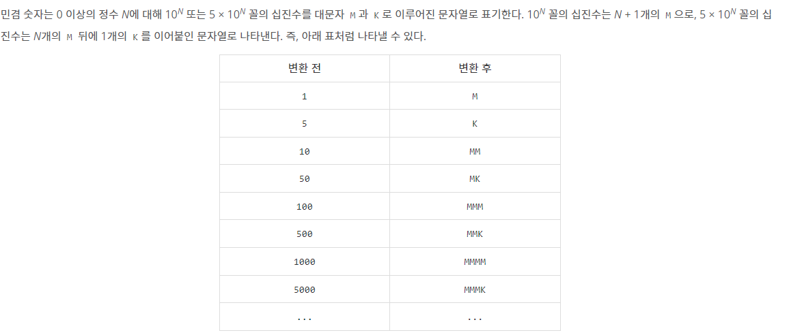

# boj 21314 : 민겸수
> 문제 주소: https://www.acmicpc.net/problem/21314
> 
> 난이도: silver 1

## 1.문제설명
- 민겸수라는 것이 존재한다.
- 규칙은 다음과 같을 때, 민겸수가 주어졌을 때 최대값, 최소값을 구해라.


## 2.문제해결 아이디어.
- 최대값, 최소값을 만들때 규칙을 찾자
- 최대값을 만들려면 일단 M을 최대한 모아서 그 뒤에 K를 붙혀야한다
- 최소값을 만들려면 M과 K를 붙히면 안된다.
## 3.문제접근법
```python
for n in num: #문자열의 문자 하나하나를 순회하며
    if n == 'M': #문자가 M이면 카운트를 증가시킨다.(M이 나왔는지, 나왔으면 몇개나왔는지 기록위함)
        cnt += 1
    else: #K가 나왔을 때
        if cnt > 0: #M이 한번이라도 나왔다면
            min += str((10 ** cnt)+5) #최소값을 만들기 위해선 M따로 K따로 해서 15를 만들어야함
            max += str(5 * (10 ** cnt)) #최대값을 만들기 위해선 M만큼 0을 붙히고 5를 곱해야함
        else: #M이 안나왔으면 그냥 둘다 5로 처리해줌
            min += '5'
            max += '5'
        cnt = 0
```
```python
#마지막이 M으로 끝났을 때
if cnt > 0:
    min += str(10 ** (cnt-1)) #최소값은 10, 100과 같이 끝내면됨
    max += '1' * cnt #최대값은 11, 111과 같이 끝내면됨
```
## 4.특별히 참고할 사항
- 규칙을 찾으면 구현은 별로 어렵지않다.
## 5.코드구현
``` python
num = input()
min, max = '', ''
cnt = 0

for n in num:
    if n == 'M':
        cnt += 1
    else:
        if cnt > 0:
            min += str((10 ** cnt)+5)
            max += str(5 * (10 ** cnt))
        else:
            min += '5'
            max += '5'
        cnt = 0

if cnt > 0:
    min += str(10 ** (cnt-1))
    max += '1' * cnt

print(max)
print(min)
```