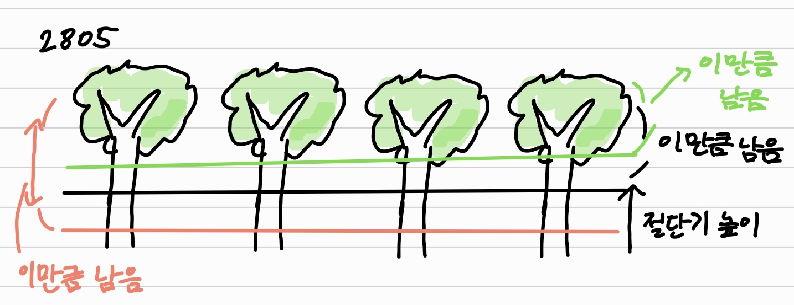

# boj 2805 : 나무 자르기 
> 문제 주소: https://www.acmicpc.net/problem/2805
> 
> 난이도: silver 3

## 1.문제설명
- 나무 N개가 주어진다.
- 나무를 벌목할 것이고, 나무 M미터가 필요하다.
- 최소한 M미터의 나무를 집에 가져가기 위해 절단기에서 설정할수 있는 높이의 최댓값은?(높이는 정수)
## 2.문제해결 아이디어.
- 이분탐색으로 풀어야한다.
- 데이터 갯수가 매우 많아서, 정렬을 통해 풀면 시간복잡도 초과를 당할 것
## 3.문제접근법
- 처음에 low = 0, high = max(나무길이 리스트)로 설정하고
- mid = (low + high) // 2로 절단기 높이를 설정하고 자른다.
- 만약 그렇게 설정하고 자른값들이 M보다 작으면
    - high = mid - 1을 해서 상한을 제한하고
- M보다 클때는
  - low = mid + 1을 해서 하한을 제한한다.
  - 그리고 이때 일단 정답을 업데이트 시켜준다.
```python
while low <= high:
    total = 0
    mid = (low + high) // 2
    for tree in trees:
        if tree > mid:
            total += tree-mid
    if total < M:
        high = mid - 1
    else:
        ans = mid #밑의 과정을 통해 while문이 끝날수도 있기때문에 업데이트 해준다.
        low = mid + 1
```

## 4.특별히 참고할 사항
- 이는 우리가 숫자맞추기 up down게임을 하는 것과 같다.
## 5.코드구현
``` python
N, M = map(int, input().split())
trees = list(map(int, input().split()))

low = 0
high = max(trees)

ans = 0
while low <= high:
    total = 0
    mid = (low + high) // 2
    for tree in trees:
        if tree > mid:
            total += tree-mid
    if total < M:
        high = mid - 1
    else:
        ans = mid
        low = mid + 1

print(ans)
```