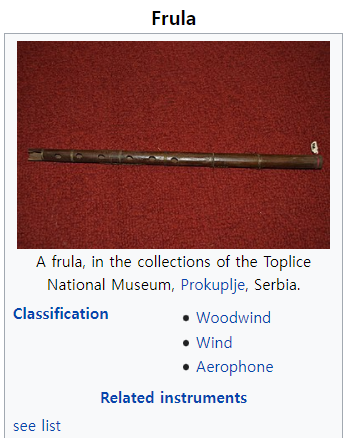

# boj 9935 : 문자열 폭발 
> 문제 주소: https://www.acmicpc.net/problem/9935
> 
> 난이도: gold 4

## 1.문제설명
- 문자열과, 폭발물에 해당하는 문자열이 주어진다.
- 문자열에 폭발물이 있으면 그 부분은 사라지고, 폭발물 기준으로 왼쪽 오른쪽 문자열이 붙는다.
- 폭발물이 하나도 남지 않을때 까지 이 과정이 반복됐을 때 문자열을 출력해라
- 아무것도 남지 않으면 FRULA를 출력해라
- 
## 2.문제해결 아이디어.
- 처음에는 문자열 내장함수인 find를 사용해서 해결하려 했다. 
  - 하지만 시간초과!
- 카테고리를 보고 스택이 있는 것을 보고 스택을 이용해서 풀었다....
## 3.문제접근법
- 스택을 만들고 거기에 확인할 문자열을 하나씩 넣는다.
- 넣다가 폭탄의 끝글자와 같은 문자가 들어갔고, 그리고 스택에 들어가있는 문자의 수가 폭탄의 문자 수보다 많고
  - 폭탄의 길이만큼 스택의 마지막 문자들을 슬라이싱해서 그게 폭탄과 같은지 비교하고 맞다면
    - 폭탄의 길이만큼 스택에서 pop한다.
```python
stack = []
for i in range(len(S)):
    stack.append(S[i])
    if stack[-1] == bomb[-1] and len(stack) >= len(bomb):
        if stack[-len(bomb):] == bomb:
            for i in range(len(bomb)):
                stack.pop()
```
## 4.특별히 참고할 사항
- 태그는 분명... 문자열이였는데
- 스택의 개념없이는 풀수 없는 문제였다
## 5.코드구현
``` python
import copy
S = list(input())
bomb = list(input())
stack = []
for i in range(len(S)):
    stack.append(S[i])
    if stack[-1] == bomb[-1] and len(stack) >= len(bomb):
        if stack[-len(bomb):] == bomb:
            for i in range(len(bomb)):
                stack.pop()

if stack:
    print("".join(stack))
else:
    print("FRULA")
```